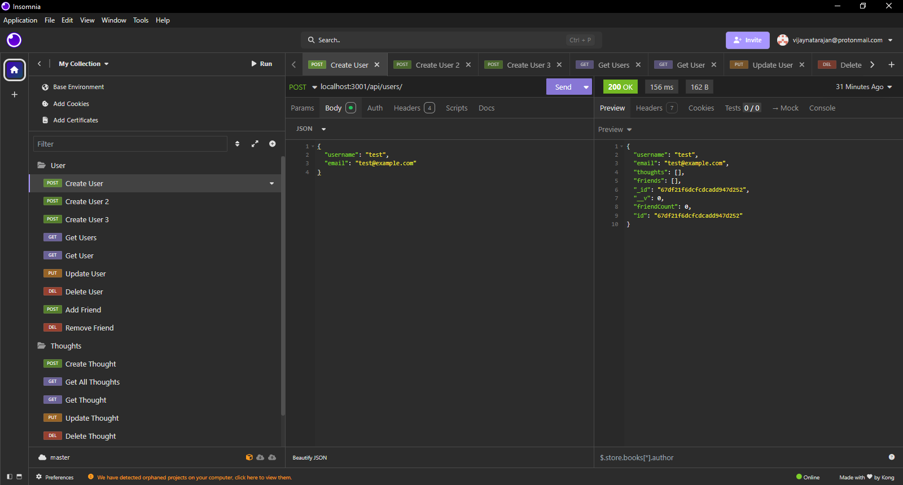
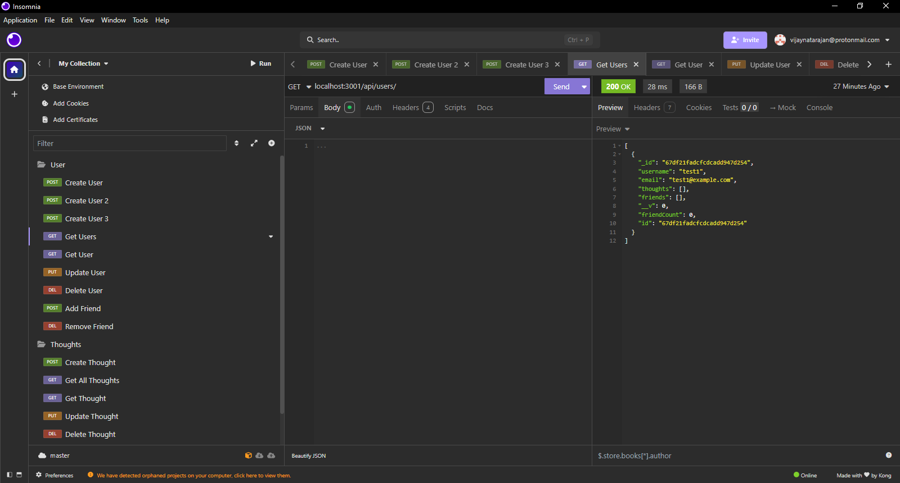
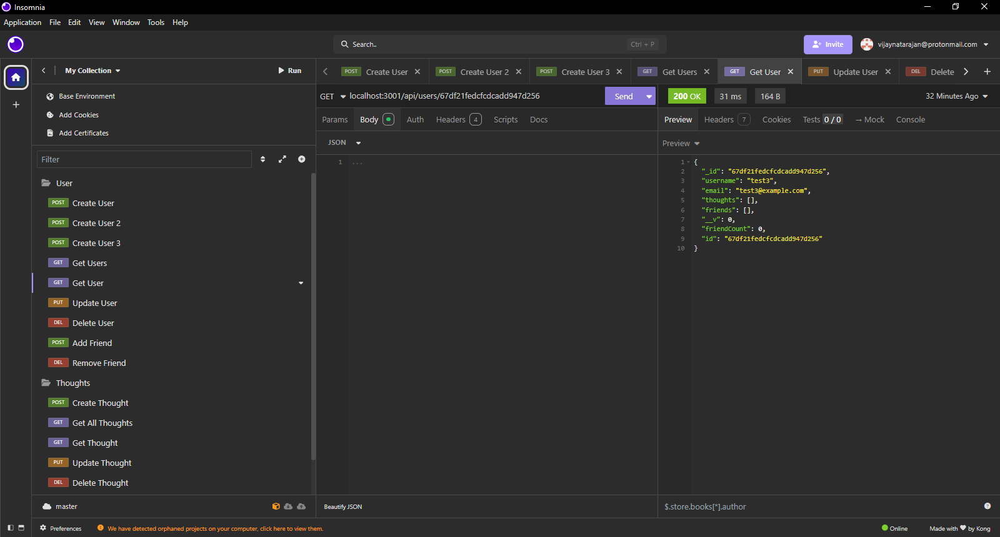
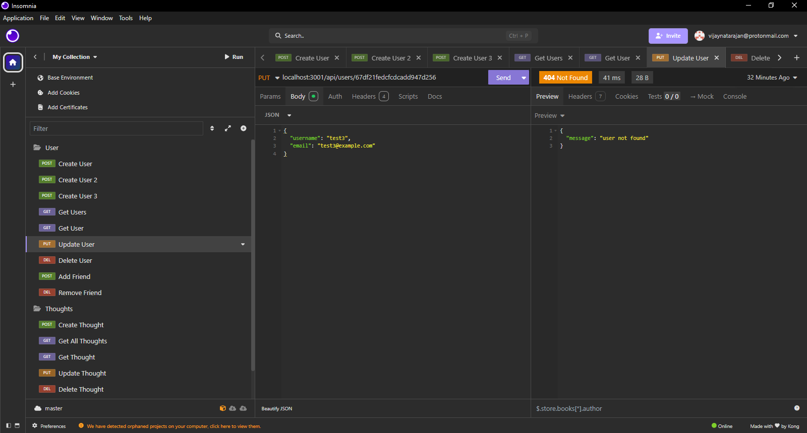
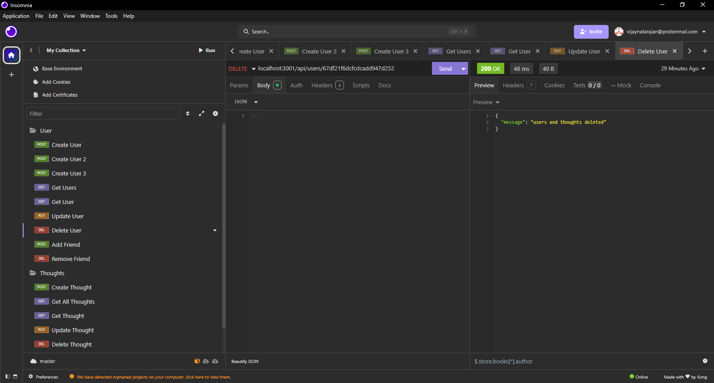
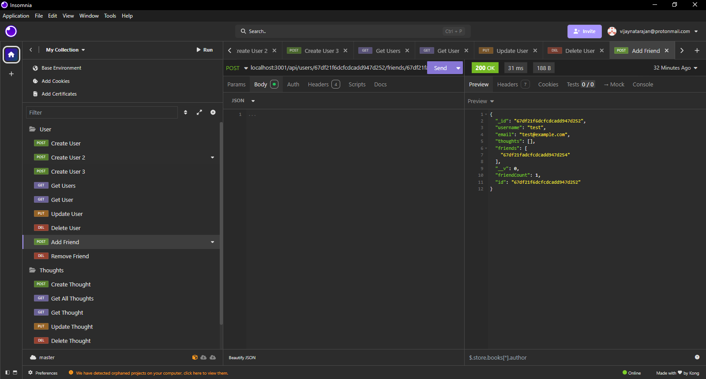
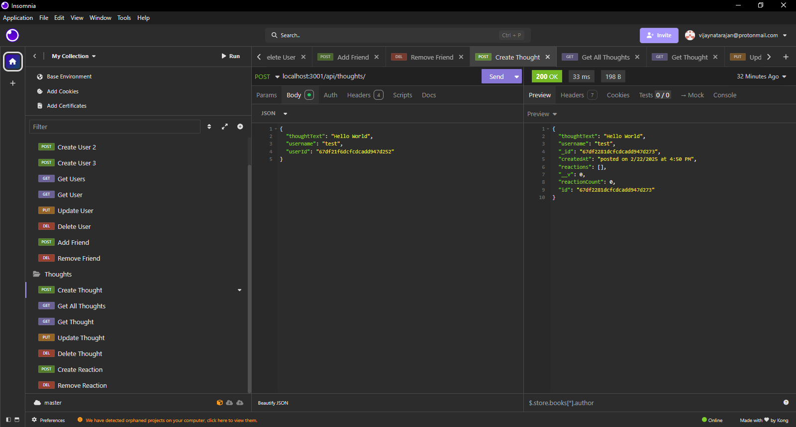
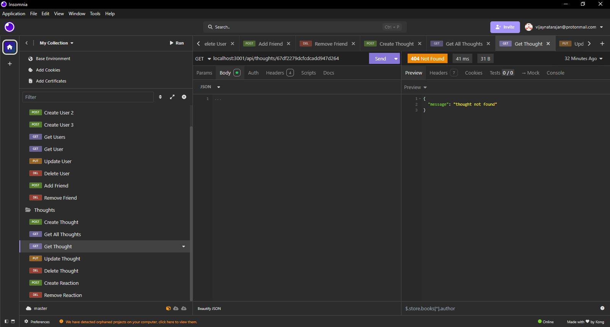
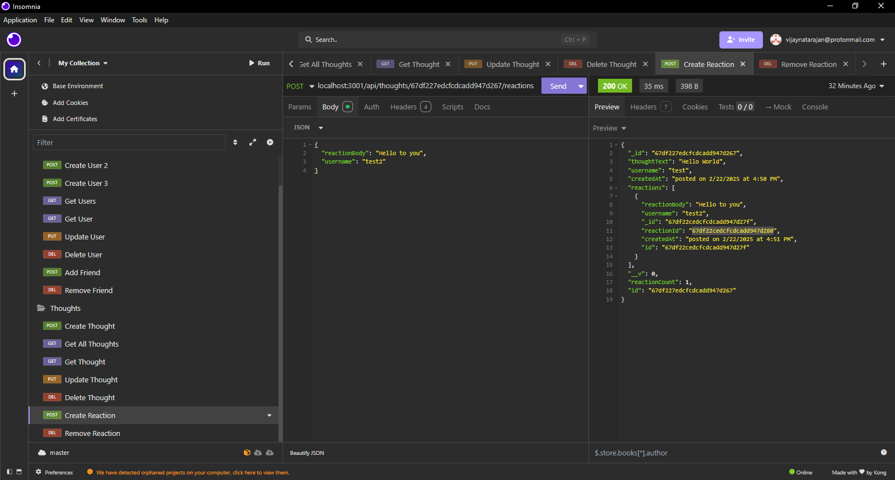
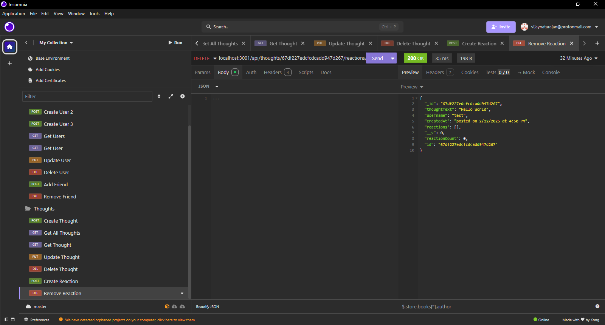

# Social Network

## Description

In this Application, the backend for a social media platform was created using the express and mongoose libraries for node.js. A MongoDB database is created which holds Users, Thoughts a User can create and Reactions to the Thoughts. Users can also be assigned Friends to other Users in the database. Using the Insomnia platform, the application can send API commands to create a User, view all Users, view a single User, update a Users information, delete a User, add and remove a Friend from a user, create a Thought, view all Thoughts, view a single thought, update a Thought, delete a Thought, create and add a Reaction to a thought, and remove a Reaction from a thought

## Installation

To install this package, clone the repository and run 'npm i' to install all dependencies

## Usage
A video showing an example of usage can be seen at: https://drive.google.com/file/d/1SWASADmnVTYZ20bDXGo_npDpiNPRuvQz/view

To start building and view the social media database, the application Insomnia must be used

The first step is to create Users. Users can be created by sending a POST request to the url 'localhost:3001/api/users/' along with a body JSON like
{
	"username": "test",
	"email": "test@example.com"
}

Once Users are created, a list of Users can be displayed by send a GET request to the url 'localhost:3001/api/users/'. 

A single User can be displayed by sending a GET request to the url 'localhost:3001/api/users/:userId' with the specific UserId in the url.  

A single User can be updated by sending a PUT request to the url 'localhost:3001/api/users/:userId' with the specific UserId in the url along with a body JSON like
{
	"username": "test",
	"email": "test@example.com"
}

 
A signle User and all associated Thoughts can be deleted by sending a DELETE request to the url 'localhost:3001/api/users/:userId' with the specific UserId in the url.

 
A Single User can gain a Friend by sending a POST request to the url 'localhost:3001/api/users/:userId/friends/:friendsId' with the specific UserId and friendsId in the url. This friend can also be removed by sending a DELETE request to the same address.

 
A Thought can be created and associated to a User by sending POST request to the url 'localhost:3001/api/thoughts/'along with a body JSON like
{
	"thoughtText": "Hello World Updated",
	"username": "test",
	"userId": "userId for test"
}
All created Thoughts can be seen by sending a GET request to the same url.

A single Thought can be seen by sending a GET request to the url 'localhost:3001/api/thoughts/:thoughtId' with the specific ThoughtId in the url.

A single Thought can be updated by sending a PUT request to the url 'localhost:3001/api/thoughts/:thoughtId' with the specific ThoughtId in the url along with a body JSON like
{
	"thoughtText": "Hello World",
	"username": "test",
}
A thought can get deleted by sending a DELETE request to the same url.
 

A Reaction can be created and associated to a thought and user by sending a POST request to the url localhost:3001/api/thoughts/:thoughtId/reactions' with the specific ThoughtId in the url along with a body JSON like
{
	"reactionBody": "Hello to you",
	"username": "test"
}

A Reaction can be removed from a Thought by sending DELETE Request to the url localhost:3001/api/thoughts/:thoughtId/reactions/:reactionId' with the specific ThoughtId and ReactionId in the url.

## Credits

Vijay Natarajan (github.com/santoshalper)
